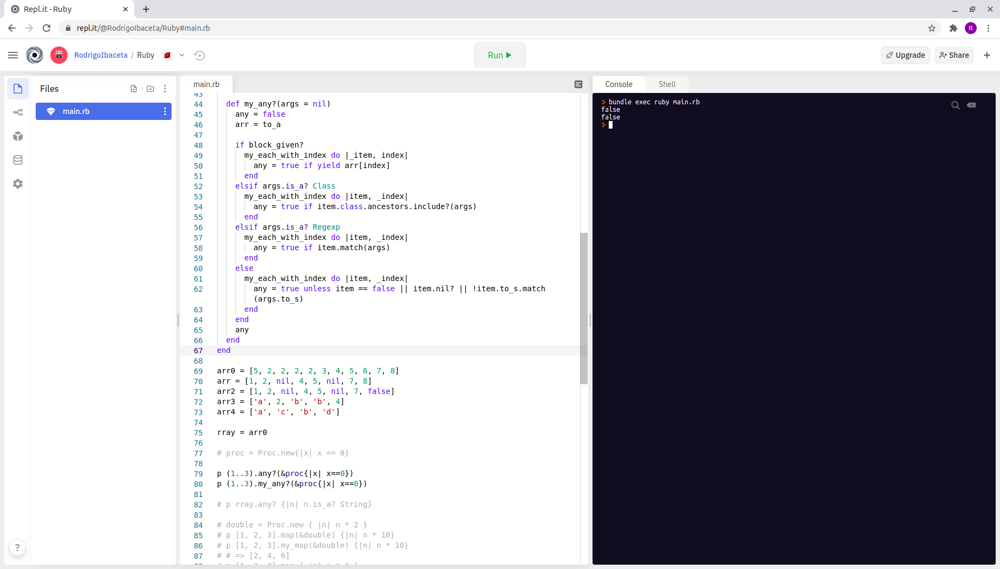

# Enumerable methods
 In this project we worked on simulating the original enumerable methods and creating ours.

 
## Built With

- RUBY

## Usage

- Clone the repository into a new directory: git clone https://github.com/RokoVarano/Enumerables.git
- In the created directory (root directory), run: 
open my_enumerables.rb

- clone the repository `git clone git@github.com:RailonA/enumerable-methods.git`
- for using the methods, use import 'my_enumerables' into your project. Then 
call the desired method on whatever variable you need.

## Tests

To install and run tests:
- In terminal, in root directory of the project: run 'gem install rspec'
- In terminal, in root directory of the project: run 'rspec'

## Authors

👤 **Mohammed Atef**

- GitHub: [Mohammed Atef](https://github.com/Mohamed-js)
- Twitter: [@MohammedAtef](https://twitter.com/Demovejetta)
- LinkedIn: [LinkedIn](https://www.linkedin.com/in/mohamed-atef-032b6b1b0/)

👤 **Rodrigo Ibaceta**

- GitHub: [Rodrigo Ibateca](https://github.com/RokoVarano/)
- Twitter: [@Rodrigo](https://twitter.com/RodrigoIbacet11)
- LinkedIn: [LinkedIn](https://www.linkedin.com/in/rodrigo-ibaceta-a8657611a/)

👤 **Railon Acosta**
- GitHub: [@railonA](https://github.com/RailonA)
- Linkedin: [@railonAcosta](https://www.linkedin.com/in/railon-acosta-81265180/)
- Twiter: [@railonAcosta](https://twitter.com/RailonAcosta)

## 🤝 Contributing

Contributions, issues, and feature requests are welcome!

## Show your support

Give a ⭐️ if you like this project!

## Acknowledgments

Thanks for the both parties involved in the development of this project.
