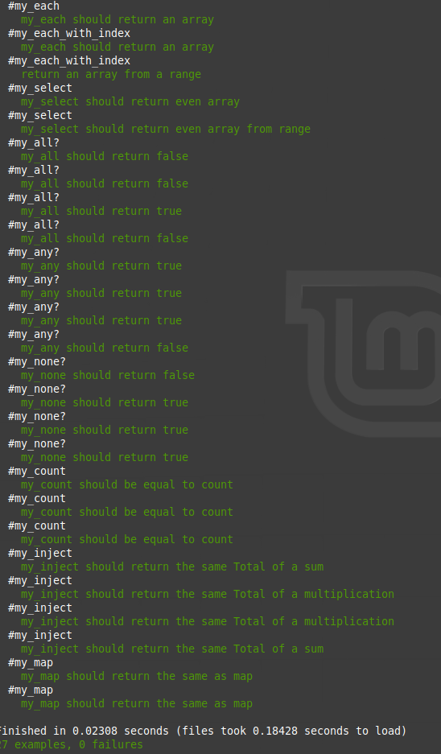

# RSpec Testing for Tic Tac Toe

> Testing Enumerables methods using RSpec framework

# Screenshot 

## Built With

- Ruby
- RSpec

## Getting Started

To get a local copy up and running follow these simple example steps.

### Install

Install rspec following this guide: [Install](https://www.theodinproject.com/courses/ruby-programming/lessons/introduction-to-rspec)

### Usage

- Open your terminal (CTRL + ALT + T) and clone the repository of this project.
- `cd` to the directory 

### Run tests

- run `rspec` to run the tests

## Authors

👤 **Mohammed Atef**

- GitHub: [Mohammed Atef](https://github.com/Mohamed-js)
- Twitter: [@MohammedAtef](https://twitter.com/Demovejetta)
- LinkedIn: [LinkedIn](https://www.linkedin.com/in/mohamed-atef-032b6b1b0/) 

👤 **Alicia Paz Rojas**

- GitHub: [@aliciapaz](https://github.com/aliciapaz)
- Twitter: [@_alicia_paz](https://twitter.com/_alicia_paz)
- LinkedIn: [Alicia Rojas](https://www.linkedin.com/in/alicia-rojas-71468418a/)

## 🤝 Contributing

Contributions, issues, and feature requests are welcome!

## Show your support

Give a ⭐️ if you like this project!

## Acknowledgments

- The Odin Project

## 📝 License

This project is [MIT](LICENSE) licensed.
